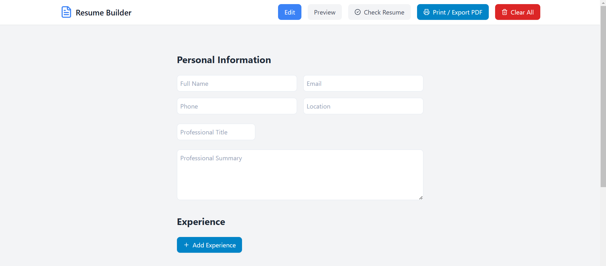
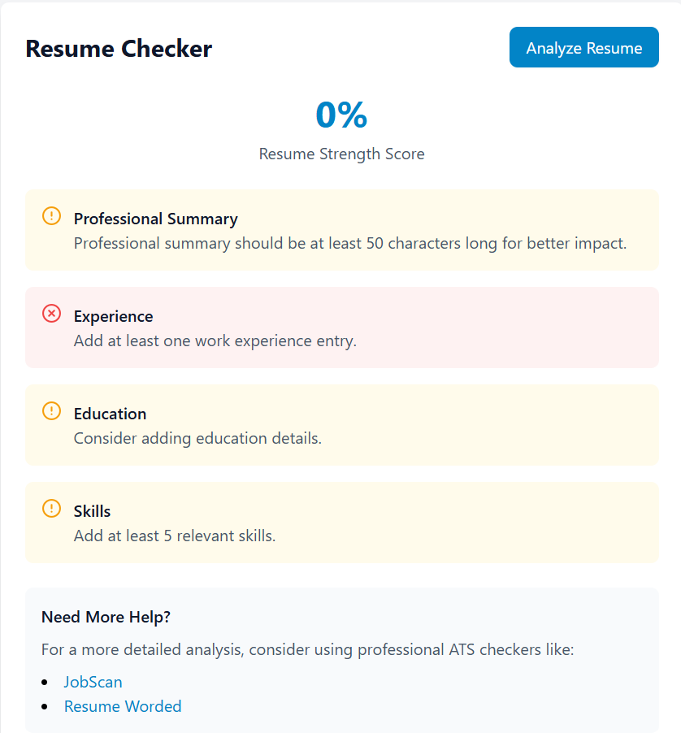

# QuikResumeBuilder

A modern, feature-rich resume builder application built with React and TypeScript. Create professional resumes with ease, get instant feedback, and export to PDF.

## Live Demo

Check out the live version of this project [here](https://superlative-gaufre-ed0ee0.netlify.app/).

## Features

- 📝 **Real-time Preview**: See changes as you type
- 🔍 **Resume Checker**: Get instant feedback on your resume's strength
- 📊 **ATS Compatibility**: Ensure your resume passes Applicant Tracking Systems
- 💾 **Export to PDF**: Download your resume in PDF format
- 🎯 **Guided Sections**: Helpful tips and examples for each section
- 📱 **Responsive Design**: Works seamlessly on desktop and mobile devices

## Resume Sections

- 👤 Personal Information
- 💼 Professional Experience
- 🎓 Education
- 🛠️ Skills
- 📝 Professional Summary

## Resume Checker Features

- ✅ Resume Strength Score
- 📊 Section-by-section Analysis
- 💡 Improvement Suggestions
- 🎯 ATS Optimization Tips
- 🔗 Links to Professional ATS Checkers

## Tech Stack

- React
- TypeScript
- Tailwind CSS
- Vite
- react-to-print
- Lucide Icons

## Live Demo

[Try QuikResumeBuilder](https://quikresumebuilder.netlify.app)

## Local Development

1. Clone the repository:
\`\`\`bash
git clone https://github.com/1enMap/Resume-Builder.git
\`\`\`

2. Install dependencies:
\`\`\`bash
cd Resume-Builder
npm install
\`\`\`

3. Start the development server:
\`\`\`bash
npm run dev
\`\`\`

4. Open [http://localhost:5173](http://localhost:5173) in your browser

## Contributing

Contributions are welcome! Please feel free to submit a Pull Request.

## License

This project is licensed under the MIT License - see the [LICENSE](LICENSE) file for details.

## Author

[@1enMap](https://github.com/1enMap)

---
Built with ❤️ using React and TypeScript
